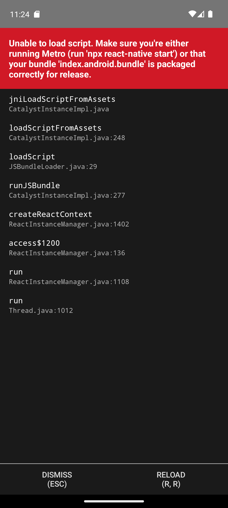
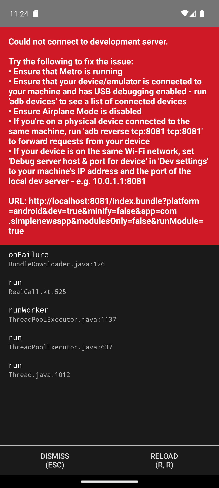
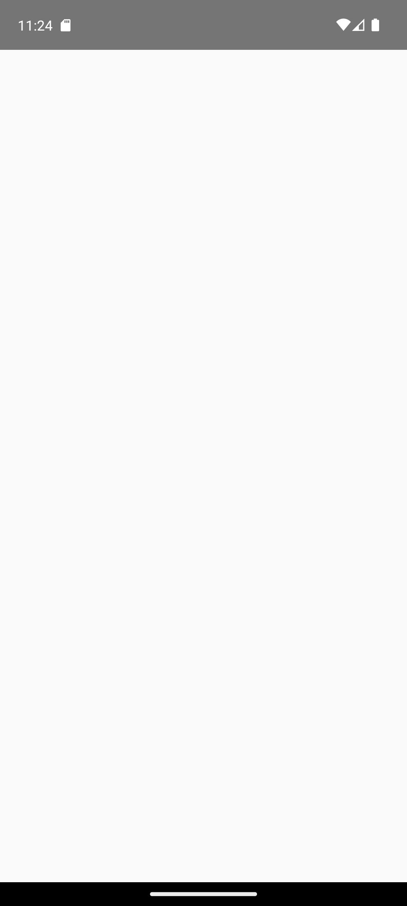

<div align="center" id="top"> 
  <!--  -->

&#xa0;

  <!-- <a href="https://simplenewsapp.netlify.app">Demo</a> -->
</div>

<h1 align="center">SimpleNewsApp</h1>

<p align="center">
  

  

  

  

  <!--  -->

  <!--  -->

  <!--  -->
</p>

<!-- Status -->

<!-- <h4 align="center">
	🚧  Simplenewsapp 🚀 Under construction...  🚧
</h4>

<hr> -->

<p align="center">
  <a href="#dart-about">About</a> &#xa0; | &#xa0; 
  <a href="#sparkles-features">Features</a> &#xa0; | &#xa0;
  <a href="#camera-screenshots">Screenshots</a> &#xa0; | &#xa0;
  <a href="#rocket-technologies">Technologies</a> &#xa0; | &#xa0;
  <a href="#white_check_mark-requirements">Requirements</a> &#xa0; | &#xa0;
  <a href="#checkered_flag-starting">Starting</a> &#xa0; | &#xa0;
  <a href="#memo-license">License</a> &#xa0; | &#xa0;
  <a href="https://github.com/wildanfadh" target="_blank">Author</a>
</p>

<br>

## :dart: About

Simple News App made with React Native. UI Reference from <a href="https://www.figma.com/file/MQvjBVpbUPXOmW9n2jevYe/Simple-News-UI-Kit-%7C-iPhone-13-(Community)?node-id=64%3A457">Figma Simple News Mobile UI Kit</a> but not all features are implemented.

## :sparkles: Features

:heavy_check_mark: Home screen with news list and tag filter;\
:heavy_check_mark: Search screen with search input;\
:heavy_check_mark: Bookmark screen for saved news;\
:heavy_check_mark: Detail news screen with full content;\
:heavy_check_mark: Bottom tab navigation;\
:heavy_check_mark: Bookmark functionality with AsyncStorage;\
:heavy_check_mark: Search history tracking;

## :camera: Screenshots

<div align="center">
  <table>
    <tr>
      <td></td>
      <td></td>
      <td></td>
      <td></td>
    </tr>
    <tr>
      <td align="center">Home</td>
      <td align="center">Search</td>
      <td align="center">Bookmark</td>
      <td align="center">Detail</td>
    </tr>
  </table>
</div>

## :rocket: Technologies

The following tools were used in this project:

- [Node.js](https://nodejs.org/en/)
- [React](https://pt-br.reactjs.org/)
- [React Native](https://reactnative.dev/)
- [TypeScript](https://www.typescriptlang.org/)
- [NativeBase](https://nativebase.io/)
- [React Navigation](https://reactnavigation.org/)
- [AsyncStorage](https://react-native-async-storage.github.io/async-storage/)
- [React Native Vector Icons](https://github.com/oblador/react-native-vector-icons)

## :white_check_mark: Requirements

Before starting :checkered_flag:, you need to have [Git](https://git-scm.com), [Node](https://nodejs.org/en/), and [Yarn](https://yarnpkg.com/) installed.

## :checkered_flag: Starting

```bash
# Clone this project
$ git clone https://github.com/wildanfadh/simplenewsapp

# Access
$ cd simplenewsapp

# Install dependencies
$ yarn

# Run the project (also run android studio)
$ yarn android

# The app project will automatically run in android studio
```

## :memo: License

This project is under license from MIT. For more details, see the [LICENSE](LICENSE.md) file.

Made with :heart: by <a href="https://github.com/wildanfadh" target="_blank">Wildan Fadh</a>

&#xa0;

<a href="#top">Back to top</a>
